# Analysis of k-Space Undersampling Strategies and Their Effect on MRI Reconstruction Quality

**Course:** 24EC3112 Discrete Time Signal Processing — Project-Based Learning

All numbers in this report come from `results/tables/*.csv`, which `python scripts/run_all.py` regenerates. Figures are in `results/figures/` and their captions are collected in `results/figures/captions.md`. Timing numbers (E6) change slightly from run to run; every other number is deterministic because all randomness is seeded (seed 0, stored in `results.csv`).

---

## 1. Abstract

We undersample fully sampled 2D Cartesian k-space of an MRI brain slice and a Shepp–Logan phantom in seven ways: full, uniform, uniform + ACS, random, variable-density random, partial Fourier and centric low-pass. We reconstruct with zero-filling, apodization, conjugate symmetry, POCS and L1-wavelet compressed sensing (CS-FISTA). Undersampling multiplies k-space by a mask. By the convolution theorem this is a circular convolution of the image with the mask's point spread function (PSF), and we verify this to 1e-8 with a direct, FFT-free convolution. The PSF explains every artefact we observe.

- A comb PSF gives coherent ghosts at exactly N/R. The measured spacing is within 0.24 px of N/R for R = 2…8.
- A Dirichlet PSF gives blur and Gibbs ringing.
- A flat random sidelobe floor gives incoherent, noise-like aliasing.

At R = 4 the zero-fill NRMSE on the brain ranges from 0.12 (low-pass) to 0.71 (uniform), even though every mask keeps the same 64 lines. Across all masks and accelerations, the PSF's sidelobe energy fraction ranks zero-fill error with Spearman ρ = 0.93, against ρ = 0.58 for the acceleration factor. The PSF's coherence decides whether a sparsity-based reconstruction can remove that error. For comb PSFs, CS removes nothing (0.705 → 0.706 at R = 4). For variable-density PSFs, CS removes 45% of the error (0.202 → 0.112).

## 2. Theory

### 2.1 Undersampling is convolution with the PSF (CO1)

Let x[n] be the N₁×N₂ image and K[k] = DFT{x}[k] its k-space. A sampling mask M[k] ∈ {0,1} keeps some samples. The zero-filled reconstruction is

  x̂ = IDFT{M · K}.

The DFT convolution theorem says that the inverse DFT of a product equals the circular convolution of the inverse DFTs:

  x̂[n] = (psf ⊛ x)[n] = Σ_m psf[m] · x[(n − m) mod N],  psf = IDFT{M}.

The convolution is **circular** because the DFT implicitly treats both domains as periodic with period N. Any energy the PSF moves past the edge of the field of view (FOV) therefore wraps around to the opposite edge. That is why aliased ghosts "fold over" at the image border instead of falling off it. With the unitary transforms used here (`norm="ortho"`), the right-hand side carries a factor 1/√(N₁N₂). `tests/test_theory.py::test_convolution_theorem` checks the identity against a direct summation that does not use an FFT (error < 1e-8).

**Physics constraint.** In 2D Cartesian MRI, each repetition acquires one complete readout line along k_x. Only the phase-encode index k_y costs time, so a mask is a 1D pattern m[k_y] broadcast along k_x. Its PSF is then a delta along x times a 1D kernel along y:

  psf[n_y, n_x] = p[n_y] · δ[n_x].

All artefacts therefore spread only along the phase-encode direction (vertically in every figure).

### 2.2 Sampling theorem in k-space and the FOV/R aliasing period (CO3)

Sampling k_y at spacing Δk gives an image that is periodic with period 1/Δk. To avoid overlap, the period must be at least as large as the object: **Δk ≤ 1/FOV**. Keeping every R-th line makes Δk' = R·Δk, so the image period shrinks to FOV/R.

Formally, the uniform mask is an impulse train (comb) of period R:

  m[k] = Σ_j δ[k − jR].

Its N-point IDFT is again a comb, with period N/R and R equal taps:

  p[n] = (1/R) Σ_{q=0}^{R−1} δ[n − qN/R].

Convolving the image with this kernel produces R superimposed copies at spacing N/R pixels, each scaled by 1/R. These are **coherent ghosts**, and there are R − 1 of them.

### 2.3 Truncation is windowing (CO3/CO4)

Keeping only the central L lines multiplies k_y by a rectangular window of length L. Its inverse DFT is a Dirichlet (periodic sinc) kernel:

  p[n] = sin(πLn/N) / (N·sin(πn/N)).

This kernel has a mainlobe about N/L pixels wide (blur) and sidelobes that decay only as 1/n, with the first at −13.3 dB (Gibbs ringing). Truncation produces no replicas, so it produces no aliasing. Replacing the rectangle with a tapered window w[k] is exactly the FIR window-design trade-off: lower sidelobes cost a wider mainlobe.

### 2.4 Hermitian symmetry and partial Fourier (CO3)

For a real image, K[−k] = K*[k]. Half of k-space plus the DC line therefore determines the rest, and the missing half can be filled with conjugates. MRI images carry a smooth phase φ(x), which makes them complex, so the symmetry fails. The conjugate-symmetry fill then imposes the wrong data. POCS first estimates the low-resolution phase from the symmetrically sampled centre. It then alternates two projections:

1. In image space, set x ← |x|·e^{iφ}.
2. In k-space, overwrite the sampled lines with the measured data (data consistency).

### 2.5 Zero-padding interpolates (CO3)

Zero-filled lines carry no information. Zero-padding a spectrum and inverse transforming is exactly band-limited (Dirichlet/periodic-sinc) interpolation of the existing samples. `test_zeropad_interpolates` checks this to 1e-10 against the closed-form kernels sin(πt)/(N sin(πt/N)) for odd N and sin(πt)/(N tan(πt/N)) for even N, with the Nyquist bin split in two.

### 2.6 What the PSF predicts

By Parseval, ‖x̂ − x‖² equals the energy of K on the discarded lines. The **sidelobe energy fraction** of the PSF measures the share of every object's energy that the mask moves away from where it belongs. It therefore predicts the size of the zero-fill error. The **coherence index** is the peak-to-average ratio of the sidelobes. It describes how that energy is arranged: piled into a few exact replicas (coherent) or spread thinly (incoherent). Section 5 shows that these two PSF-shape descriptors, rather than R, explain the results.

## 3. Methods

**Data.** The brain image is `skimage.data.brain()` slice 4, vendored in `data/brain_slices.npz` so that no download is needed. The phantom is `skimage.data.shepp_logan_phantom()`, resized to 256×256 with nearest neighbour so its edges stay sharp. Both are scaled to [0, 1].

There are two phase modes:

- **`none`** keeps the image real, so its k-space is exactly Hermitian. This is an idealisation.
- **`smooth`** multiplies the image by e^{iφ}, where φ is a quadratic polynomial phase spanning exactly 2π peak-to-peak.

The ground truth is |IDFT(full k-space)|.

**Transforms.** The forward transform is `fft2c = fftshift ∘ fft2(ortho) ∘ ifftshift`, which puts DC at index N/2. Parseval and the round trip both hold to 1e-10 (tested). All arrays stay `complex128` until metric time.

**Masks** (`src/masks.py`). All masks are PE-line patterns. The realised acceleration R = 256 / (sampled lines) is reported, and every comparison uses it.

| Mask | Construction | Realised R for requested 2/3/4/6/8 |
|---|---|---|
| uniform | lines with k_y ≡ 0 (mod R) | 2.00 / 3.01 / 4.00 / 5.95 / 8.00 |
| uniform_acs | uniform + 24 central lines | 1.83 / 2.53 / 3.12 / 4.06 / 4.83 |
| random | round(N/R) lines uniformly at random, DC kept | exact |
| vardens | 8% central block + lines drawn with p ∝ (1 − \|k\|/k_max)³ | exact |
| lowpass | central round(N/R) lines | exact |
| partial_fourier | lines i < frac·N, frac ∈ {0.55, 0.625, 0.75} | 1.82 / 1.60 / 1.33 |

**Reconstructions** (`src/recon.py`):

- **Zero-fill**: inverse DFT with the missing lines set to zero.
- **Apodized**: a PE window spanning the sampled k_y extent, chosen from rect, Hann, Hamming, Tukey (α = 0.5) or Blackman.
- **Conjugate symmetry**: fill each missing sample from the conjugate of its mirror.
- **POCS**: 20 iterations, with the phase estimated through a Hann window over the symmetric centre.
- **CS-FISTA**: minimises ½‖MFx − y‖² + λ‖Wx‖₁, where W is an orthonormal 4-level Haar transform with the coarse band left unpenalised. λ = 0.006, 100 iterations, step size 1 (the Lipschitz constant of MF is 1).

**Metrics** (`src/metrics.py`). All metrics compare magnitude images, and both images are divided by the reference maximum.

- NRMSE, PSNR and SSIM.
- Artefact power: the error energy divided by the reference energy.
- Edge preservation: the correlation of the two Sobel gradient magnitudes.
- Ringing index: the RMS error in a band 3–10 "truncation cells" (cells of N/L px) from PE edges of the truth. This is beyond the blur of the widest mainlobe, so only ripple is left.

**PSF metrics** (`src/psf.py`) are computed on the PE profile of |IDFT(mask)|:

- the mainlobe FWHM;
- the peak sidelobe ratio (PSR);
- the sidelobe energy fraction (energy outside the first minima on either side of the peak);
- the coherence index, max(sidelobe)/mean(sidelobe).

**Experiments** (`src/experiments.py`, `config/experiments.yaml`):

| ID | Sweep |
|---|---|
| E1 | {5 masks × R ∈ {2,3,4,6,8}, plus 3 partial-Fourier fractions, plus full} × {zero-fill, CS-FISTA} × {none, smooth} × 2 images = 232 rows |
| E2 | PSF metrics for every mask |
| E3 | Spearman correlations between candidate predictors and error |
| E4 | Low-pass frac ∈ {0.25, 0.5} × 5 windows × 2 images, plus a DTFT table for each window |
| E5 | 3 fractions × {zero-fill, conjugate symmetry, POCS} × 2 phase modes × 2 images |
| E6 | Direct DFT vs radix-2 FFT vs `numpy.fft` for N = 8…2048 |
| E7 | Ghost spacing measured from the PSF and, independently, from the image by phase correlation |

## 4. Results

### F1 — 2D DFT and energy compaction

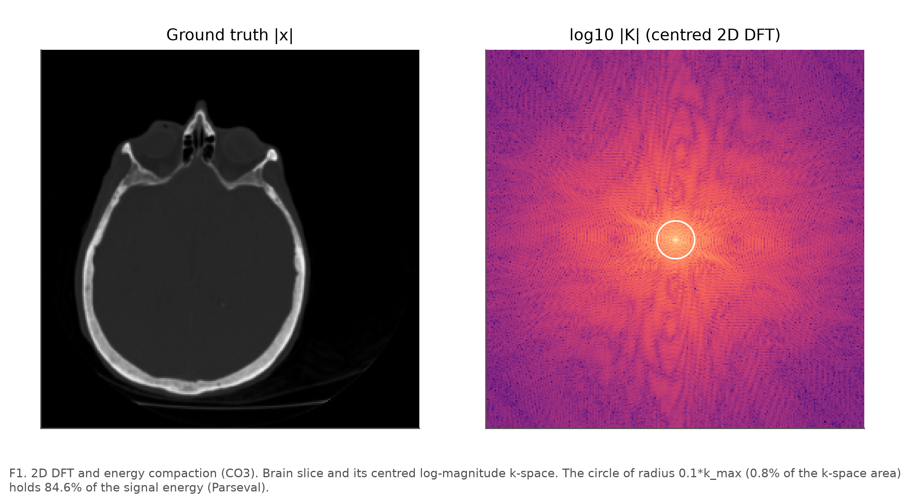

The disc of radius 0.1·k_max covers 0.8% of k-space and holds **84.6%** of the brain image's energy. This energy compaction (CO3) is the reason centre-weighted masks do well.

### F2–F5 — masks, PSFs, reconstructions, errors at R = 4

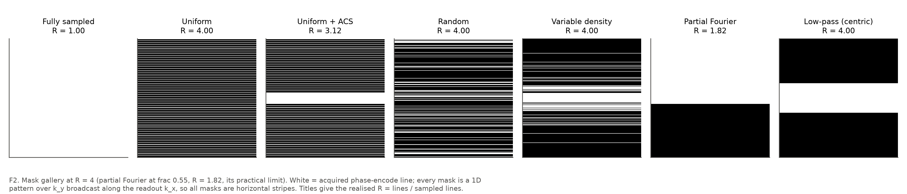
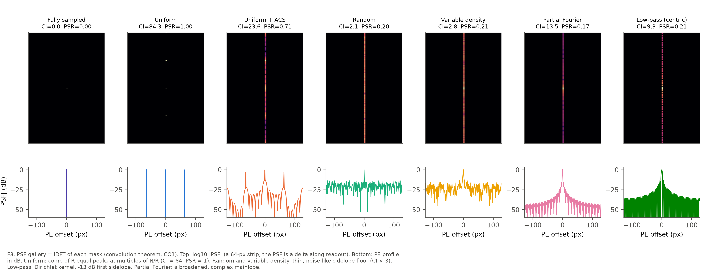
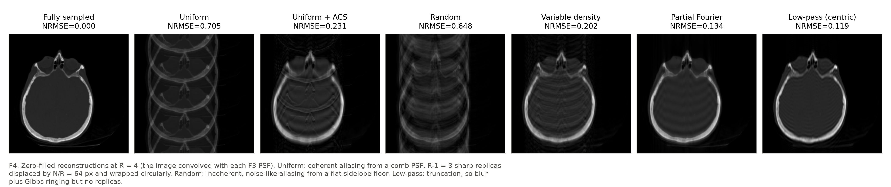
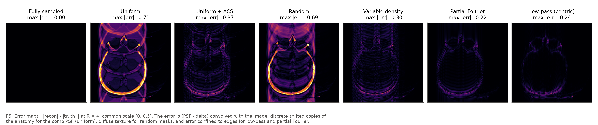

All seven masks are horizontal stripes (F2). Each reconstruction in F4 is the image convolved with the kernel shown above it in F3:

- **Uniform** (NRMSE 0.705). This is coherent aliasing from a comb-shaped PSF with R = 4 taps of equal height (PSR = 1.00, coherence index 84). The result is three full-strength replicas at 64-px spacing that wrap circularly through the FOV.
- **Random** (0.648). This is incoherent aliasing from a PSF whose sidelobes form a flat floor about −20 dB below the peak (PSR 0.20, coherence index 2.1). The leaked energy appears as streaky, noise-like texture along PE, with no recognisable copies.
- **Variable density** (0.202). The PSF has the same incoherent floor (coherence index 2.8). Its sidelobe energy fraction falls from 0.75 to 0.43 because the 8% fully sampled centre widens the mainlobe (FWHM 3.0 px) and keeps most of the energy in place.
- **Uniform + ACS** (0.231, realised R = 3.12). The ACS block adds a broad low-pass component to the comb, so the ghosts drop to PSR 0.71 and carry mostly edge energy.
- **Low-pass** (0.119). This is truncation: a Dirichlet PSF with a first sidelobe at 0.212 (−13.5 dB) and FWHM 4.8 px. The result is blur and Gibbs ringing parallel to every horizontal edge, with **no aliasing**. The error in F5 is confined to edges.
- **Partial Fourier** (0.134 at R = 1.82). The asymmetric mask gives a complex, broadened PSF (FWHM 2.3 px), so the image blurs along PE.

### F6 — quality vs acceleration

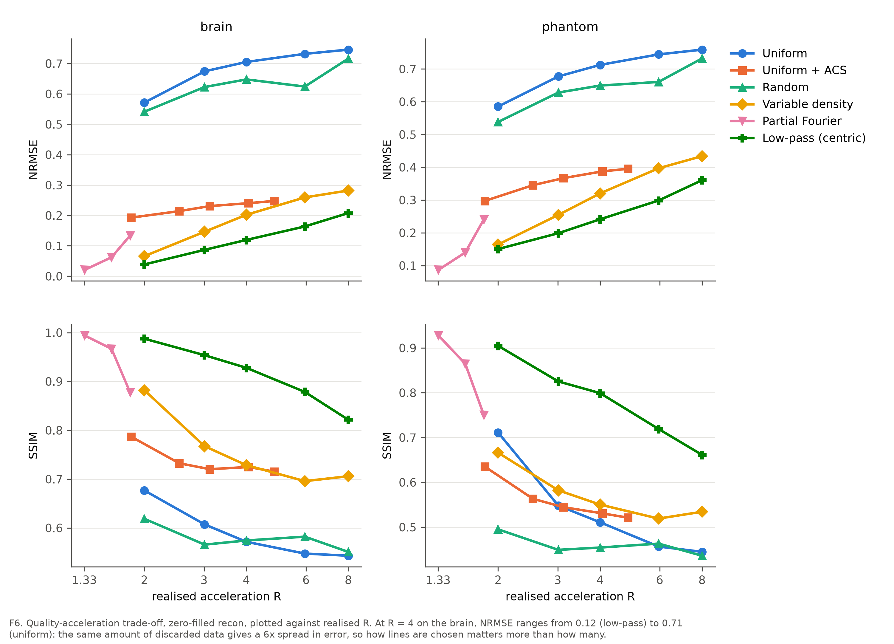

At every R, the masks split into two groups that differ by a factor of 3–6 in NRMSE. On the brain at R = 4:

- uniform 0.705 and random 0.648;
- vardens 0.202, uniform_acs 0.231 (R = 3.1) and low-pass 0.119.

Within the first group, uniform has the highest NRMSE at every R. This order is not set by acceleration: the masks with the lowest error are exactly those that keep the centre of k-space.

### F7 — PSF shape vs error (core thesis)

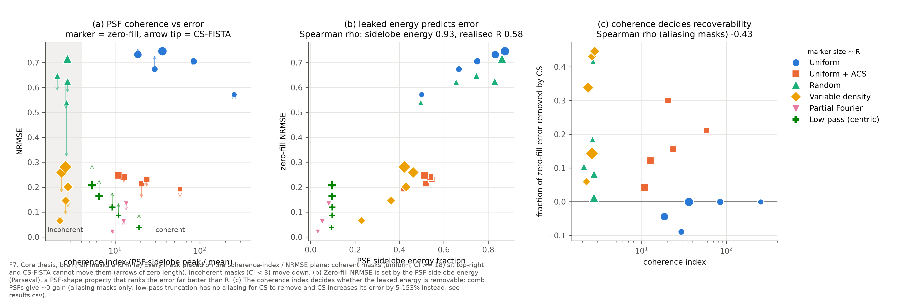

E3 (`results/tables/e3_coherence_correlations.csv`) gives the following Spearman rank correlations, over all 28 non-trivial masks and accelerations:

| Predictor → zero-fill NRMSE | brain ρ | phantom ρ |
|---|---|---|
| realised R | 0.58 | 0.61 |
| **PSF sidelobe energy fraction** | **0.93** | **0.92** |
| PSF peak sidelobe ratio | 0.65 | 0.65 |
| PSF coherence index | 0.08 | 0.07 |

| Predictor → fraction of error removed by CS (aliasing masks) | brain ρ | phantom ρ |
|---|---|---|
| coherence index | −0.43 | −0.50 |
| peak sidelobe ratio | −0.63 | −0.74 |

**Finding 1 (panel b).** The sidelobe energy fraction ranks zero-fill error far better than the acceleration factor does: ρ = 0.93 against 0.58. Two masks with identical R = 4 differ in sidelobe energy by 0.10 (low-pass) against 0.75 (uniform, random), and their NRMSE differs by 6×. *How* data is discarded matters more than *how much*.

**Finding 2 (panel a).** The coherence index on its own does **not** rank zero-fill NRMSE (ρ ≈ 0.08). Uniform and random masks at the same R leak the same energy (sidelobe fractions of 0.75 and 0.75 at R = 4). By Parseval they must have similar error energy, and they do (0.705 and 0.648). Coherence changes the *structure* of that error, not its size. This is the honest outcome of the measurement, and it narrows the thesis as stated in the brief (Section 5.1).

**Finding 3 (panels a, c).** Coherence decides whether the error can be removed. The coherence index orders the masks into two groups:

- **Comb PSFs (coherence index ≥ 18, PSR = 1).** Each alias is an exact shifted copy of the image and is just as sparse in the wavelet domain. CS-FISTA therefore cannot separate it from the image: the zero-fill → CS change is 0.572 → 0.572 at R = 2, 0.705 → 0.706 at R = 4 and 0.746 → 0.746 at R = 8. For R = 3 and 6 the error even grows slightly.
- **Incoherent PSFs (coherence index < 3).** The aliasing looks like noise to the sparsifying transform, so it is removed: vardens goes from 0.202 to 0.112 at R = 4 (−45%), and random from 0.541 to 0.316 at R = 2 (−42%).

On the phantom, which is sparser, vardens drops from 0.320 to 0.123 at R = 4 (−62%). The rank correlation is moderate (ρ = −0.43 to −0.50) because the gain also depends on how much energy leaked: random at R = 8 leaks 86% of it, and no prior can recover that. Low-pass masks are left out of panel (c). They have no aliasing for CS to remove, and the wavelet shrinkage only adds error ("gain" between −5% and −153%).

### F8 — the sampling theorem, measured

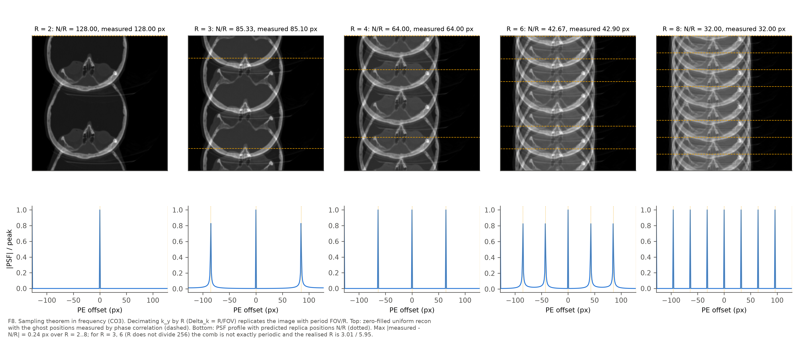

| R | N/R | measured (PSF) | measured (image) | \|error\| px |
|---|---|---|---|---|
| 2 | 128.00 | 128.00 | 128.00 | 0.00 |
| 3 | 85.33 | 85.10 | 85.10 | 0.23 |
| 4 | 64.00 | 64.00 | 64.00 | 0.00 |
| 6 | 42.67 | 42.90 | 42.90 | 0.24 |
| 8 | 32.00 | 32.00 | 32.00 | 0.00 |

The measured ghost spacing equals N/R to within **0.24 px** for every R, on both images (`e7_ghost_spacing.csv`). The PSF has exactly R peaks above half maximum in every case. When R divides N, the spacing is exact to the pixel and the R peaks are equal to 1e-10 (`test_ghost_spacing`, `test_ghost_count`, N = 240). For R = 3 and 6, 256 is not a multiple of R. The comb then has one irregular gap, so it is not exactly periodic: the realised R is 3.01 and 5.95, and the replicas are slightly broadened (PSR 0.83) but still sit within a quarter pixel of N/R. This is a numerical proof of the FOV/R aliasing period.

### F9 — windowing and Gibbs ringing (CO4)

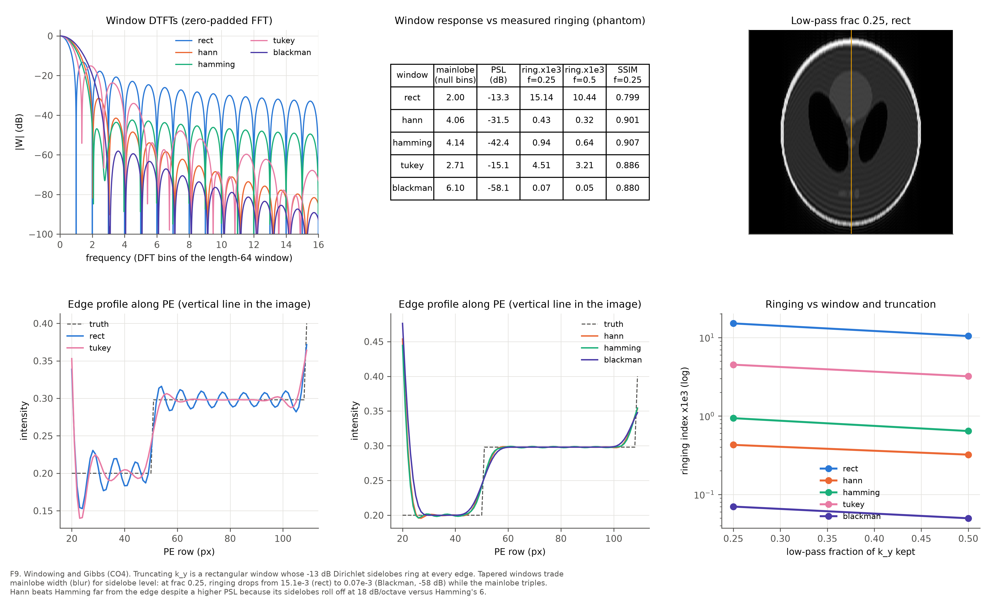

| Window | mainlobe (null-to-null, bins) | PSL (dB) | ringing ×10³, frac 0.25 | ringing ×10³, frac 0.5 | SSIM, frac 0.25 | NRMSE, frac 0.25 |
|---|---|---|---|---|---|---|
| rect | 2.00 | −13.3 | 15.14 | 10.44 | 0.799 | 0.241 |
| Tukey (α = 0.5) | 2.71 | −15.1 | 4.51 | 3.21 | 0.886 | 0.272 |
| Hamming | 4.14 | −42.4 | 0.94 | 0.64 | 0.907 | 0.324 |
| Hann | 4.06 | −31.5 | 0.43 | 0.32 | 0.901 | 0.336 |
| Blackman | 6.10 | −58.1 | 0.07 | 0.05 | 0.880 | 0.372 |

(Phantom, low-pass mask. The mainlobe width and PSL come from a 65 536-point zero-padded FFT of the length-64 window.)

The two tables line up. The rectangular window's −13 dB Dirichlet sidelobes produce the largest ringing, and each window with lower sidelobes rings less, down to Blackman at 200× less. Each step costs mainlobe width: Blackman's mainlobe is 3× wider than the rectangle's, so the edges blur and NRMSE rises from 0.241 to 0.372. This is the blur-vs-ringing trade-off of FIR design, transferred unchanged to imaging.

SSIM, which penalises the structured ripple, peaks for Hamming (0.907). NRMSE, which penalises the blur, is lowest for rect. The best window depends on what the image is for.

One instructive exception: **Hann rings less than Hamming** (0.43 against 0.94) even though Hamming has the lower *peak* sidelobe (−42 dB against −31 dB). The ringing band lies 3–10 cells from the edge, where the *far* sidelobes dominate. Hann's sidelobes roll off at 18 dB/octave, because the window and its first derivative are continuous at the ends. Hamming's roll off at only 6 dB/octave, because the window jumps to 0.08 at its ends. Both behaviours are visible in the DTFT panel. Peak sidelobe level and sidelobe decay rate are separate specifications, just as they are in filter design.

### F10 — conjugate symmetry depends on phase (CO3)

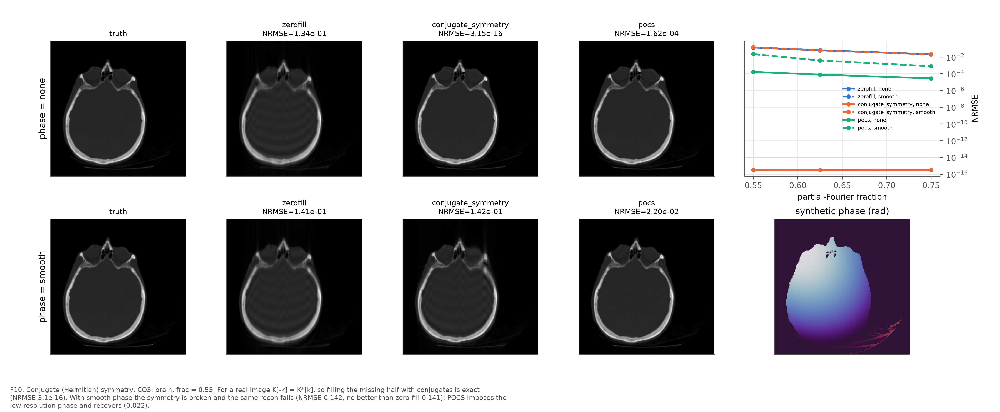

NRMSE on the brain image (phantom in brackets):

| frac | phase | zero-fill | conjugate symmetry | POCS |
|---|---|---|---|---|
| 0.55 | none | 0.134 (0.241) | **3.1e-16** (3.2e-16) | 1.6e-4 (1.2e-5) |
| 0.55 | smooth | 0.141 (0.243) | **0.142** (0.283) | **0.022** (0.024) |
| 0.625 | none | 0.062 (0.140) | 3.1e-16 | 7.7e-5 |
| 0.625 | smooth | 0.064 (0.142) | 0.060 (0.155) | 0.0038 (0.0085) |
| 0.75 | none | 0.021 (0.087) | 3.0e-16 | 2.8e-5 |
| 0.75 | smooth | 0.021 (0.086) | 0.021 (0.100) | 0.0008 (0.0029) |

- **Real image.** Hermitian symmetry holds exactly (tested to 1e-10), so the conjugate fill is exact to machine precision.
- **Smooth 2π phase.** K[−k] ≠ K*[k], so the conjugates are wrong data. On the brain at frac 0.55 the conjugate fill (0.142) is *no better than zero-fill* (0.141), and on the phantom it is worse (0.283 against 0.243).
- **POCS.** It estimates the phase from the 25 symmetrically sampled centre lines and restores it at every iteration. This closes **84% of the gap** at frac 0.55 (0.142 → 0.022) and more than 90% at the larger fractions. The residual comes from phase detail finer than the symmetric band resolves.

### F11 — FFT complexity (CO3)

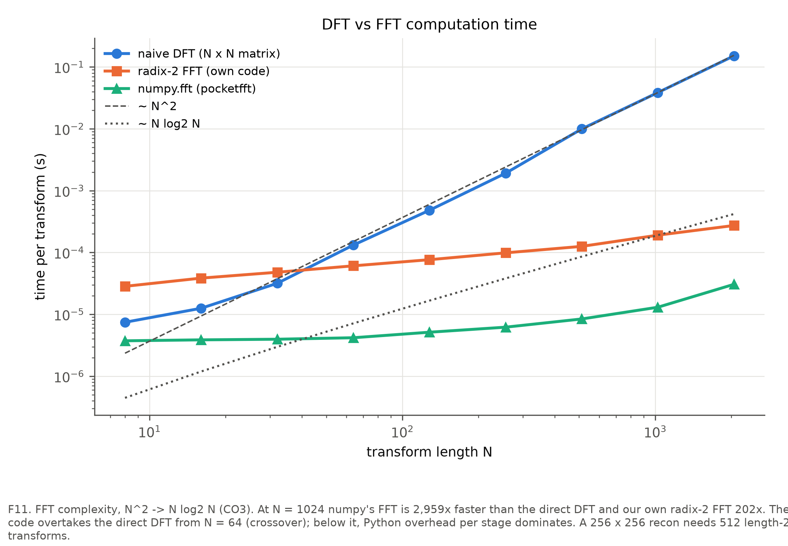

The direct DFT time follows the N² guide line, and the radix-2 FFT time follows N log₂N. At N = 1024, `numpy.fft` is **2.9 × 10³× faster** than the direct DFT in the committed run (39 ms against 13 µs), comfortably above the required two orders of magnitude. Our own vectorised radix-2 code is about 200× faster. It overtakes the direct DFT from N = 64; below that, the fixed Python cost of each of its log₂N stages dominates.

A single 256×256 reconstruction needs 2·256 transforms of length 256. With the direct DFT that is about 1 s; with the FFT it is a few milliseconds. The 100-iteration CS-FISTA sweep (2 FFTs per iteration, 128 reconstructions) would take hours with direct DFTs; with FFTs it finishes in about a minute.

### F12 — what the centre and the periphery encode

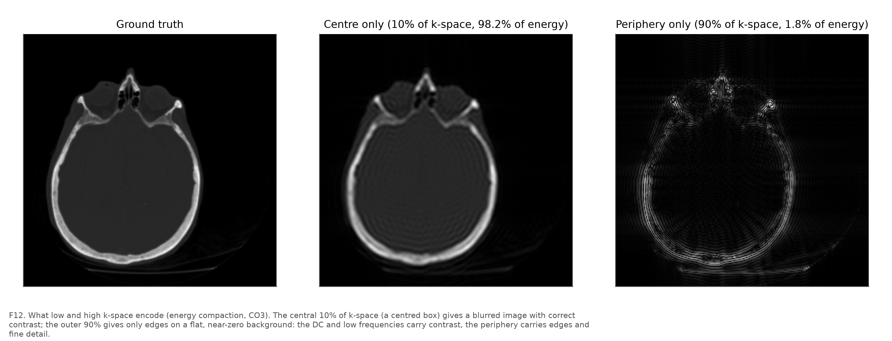

The central box covers 9.8% of k-space and holds **98.2%** of the image energy. On its own it gives a blurred image with the correct contrast. The outer 90.2% holds 1.8% of the energy and gives only edges on a near-zero background. The DC term and the low spatial frequencies set the intensities; the high frequencies set the edges.

## 5. Discussion

### 5.1 Why variable density beats uniform at equal R

At R = 4 both masks keep 64 lines. Uniform puts them on a comb, so 75% of the PSF energy moves into three exact replicas (sidelobe fraction 0.75, PSR 1.0). Variable density spends 20 lines on the centre, where most of the image energy sits (F1). Its sidelobe fraction is 0.43, and the leaked energy is spread as an incoherent floor (coherence index 2.8).

Two consequences follow:

1. The zero-fill error is 3.5× smaller (0.20 against 0.71), because less energy leaks (Parseval).
2. What does leak is noise-like, so L1-wavelet CS removes another 45% of it. The uniform mask's leak is coherent, so CS removes 0%.

The measurements therefore refine the thesis in the brief. **The amount of leakage, i.e. the PSF's sidelobe energy, sets the size of the zero-fill error. The PSF's coherence sets the form of the artefact (ghost or noise), and with it whether any non-linear reconstruction can remove it.** Both are properties of the PSF's *shape*, and neither is captured by R: ρ(R, NRMSE) is only 0.58. The coherence index by itself does not rank zero-fill NRMSE (ρ = 0.08), and we report that rather than redefine the index until it does. Its predictive role appears in the CS gain, and that is precisely the argument for compressed sensing in MRI.

### 5.2 Why truncation rings and decimation ghosts

Both low-pass and uniform masks discard 75% of the lines at R = 4.

- **Decimation** multiplies k-space by a comb. The PSF is a comb, so the image is replicated.
- **Truncation** multiplies k-space by a rectangle. The PSF is a single Dirichlet kernel with no replicas, so nothing is aliased. The image is only smoothed by the mainlobe (FWHM ≈ 1.2·N/L = 4.8 px) and rippled by the 1/n sidelobes (ripple period N/L = 4 px).

The two artefact classes have different causes, so they need different cures: windowing for ringing, more information (a prior, symmetry or coils) for aliasing.

### 5.3 Why conjugate symmetry depends on phase

K[−k] = K*[k] holds exactly when x is real. A smooth phase map makes x complex, and its own spectrum spreads energy asymmetrically about k = 0. The mirrored conjugates then disagree with the true samples. The disagreement grows with the phase bandwidth and with the size of the missing region. POCS removes the requirement that x be real and replaces it with the weaker, physically correct requirement that the phase be *smooth* and therefore estimable from the centre.

### 5.4 Where windowing helps and what it costs

Apodization helps exactly when the dominant artefact is ringing, i.e. truncation with sharp edges (phantom: SSIM 0.80 → 0.91). It cannot remove aliasing, because the replicas are not sidelobes of the window. It always costs resolution: the null-to-null mainlobe width goes from 2 bins (rect) to 4.1 bins (Hann, Hamming) and 6.1 bins (Blackman). Every taper also lowers the effective SNR, since the coherent gain falls to 0.41–0.74. A Tukey window is a good compromise when only the outermost lines need tapering: it removes 70% of the ringing for a 35% wider mainlobe.

## 6. Limitations

- **Single-coil.** Real scanners use coil arrays, whose spatial sensitivities can unfold coherent aliasing (SENSE/GRAPPA). That changes which masks are best.
- **Retrospective undersampling of magnitude images.** The data has no noise, no off-resonance and no motion. The fully sampled reference is noiseless, so NRMSE measures artefact only.
- **Synthetic phase.** The phase is a smooth quadratic. Real phase contains sharper components (susceptibility, flow), which make partial Fourier harder than shown here.
- **Cartesian sampling only.** Radial and spiral sampling have different, two-dimensional PSFs.
- **One random draw.** Random and variable-density masks use a single seed (0), so the conclusions are for one realisation. The coherence index of a random mask varies only slightly between draws (2.1–2.8 across R).
- **Untuned CS.** CS-FISTA uses one λ and a Haar wavelet for every case. Tuning λ per mask, or using total variation, would change the absolute numbers. It would not change the zero gain for comb PSFs, because that gain is zero by construction.

## 7. Future work

- Multi-coil data with SENSE and GRAPPA, measuring how the coil sensitivities turn coherent ghosts into a solvable linear system.
- Non-Cartesian trajectories through a NUFFT, and their 2D PSFs.
- Learned reconstruction (unrolled networks) evaluated on the same coherence/error plane.
- Monte-Carlo over random-mask seeds to give confidence bands on E1 and E3.
- An analytic prediction of zero-fill NRMSE from the PSF and a power-law image spectrum.

## 8. Appendix — CO mapping and evidence

| DTSP concept | CO | Where it appears | Evidence |
|---|---|---|---|
| Convolution theorem (mult ↔ conv) | CO1 | mask × K = PSF ⊛ image (`psf.py`, `recon_zerofill`) | F3, F4, F5; `test_convolution_theorem`, `test_zerofill_is_psf_convolution` |
| Linear vs circular convolution | CO1 | DFT convolution is circular, so ghosts wrap at the FOV edge | F4 / F8 (wrapped replicas); `circular_convolve_centred` |
| Impulse train / comb sequence | CO1 | uniform mask is a comb, and so is its IDFT | F3 (uniform), F8 bottom row; `test_ghost_count` |
| DTFT of a finite sequence | CO3 | truncation = rect window → Dirichlet sidelobes → Gibbs | F3 (low-pass), F9; `test_lowpass_psf_sidelobe_is_dirichlet` |
| 2D DFT and separability | CO3 | `fft2c` = row DFTs then column DFTs | F1; `test_separability` |
| Sampling theorem in frequency | CO3 | Δk ≤ 1/FOV; violating it aliases with period FOV/R | F8, E7 table; `test_ghost_spacing` |
| Conjugate (Hermitian) symmetry | CO3 | real image ⇒ K[−k] = K*[k] ⇒ partial Fourier | F10, E5; `test_hermitian_symmetry`, `test_conjugate_recon_exact/_degrades` |
| Zero-padding ↔ sinc interpolation | CO3 | zero-filling interpolates, adds no information | Section 2.5; `test_zeropad_interpolates` |
| DFT energy compaction | CO3 | centre = contrast, periphery = edges | F1 (84.6% in 0.8% of area), F12 (98.2% in 9.8%) |
| FFT complexity N² → N log₂N | CO3 | DFT vs FFT benchmark | F11, E6 table |
| Window functions (Hamming, Hann, Tukey) | CO4 | apodization to suppress Gibbs ringing | F9, E4 tables; `test_window_sidelobes` |
| Filter frequency response / sidelobes | CO4 | mainlobe width vs sidelobe level = blur vs ringing | F9 (DTFT panel + table), Section 5.4 |
